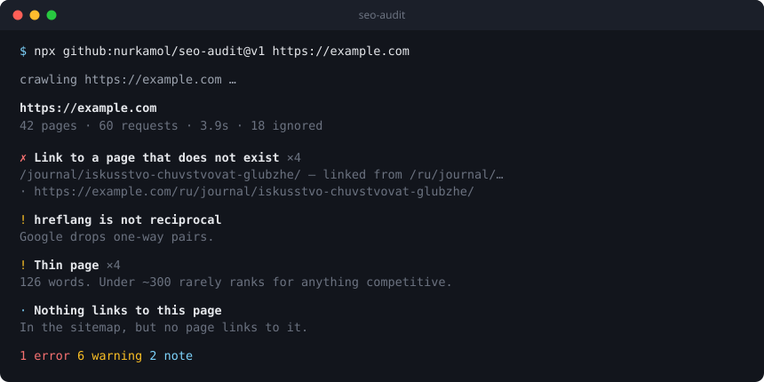
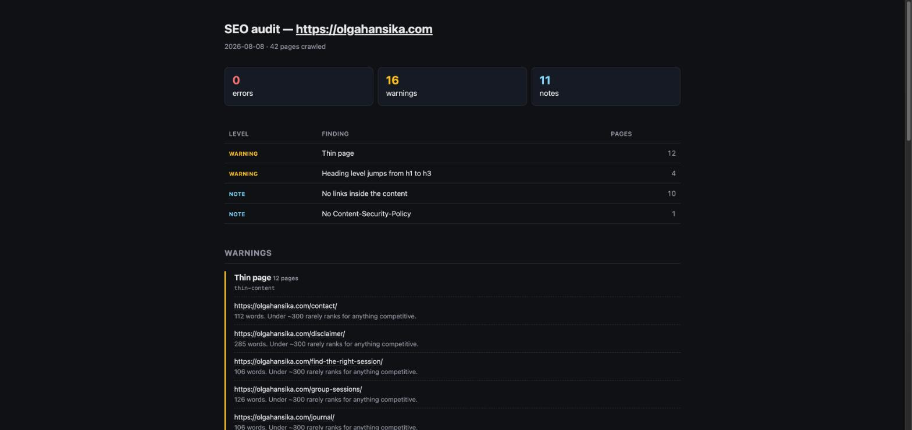
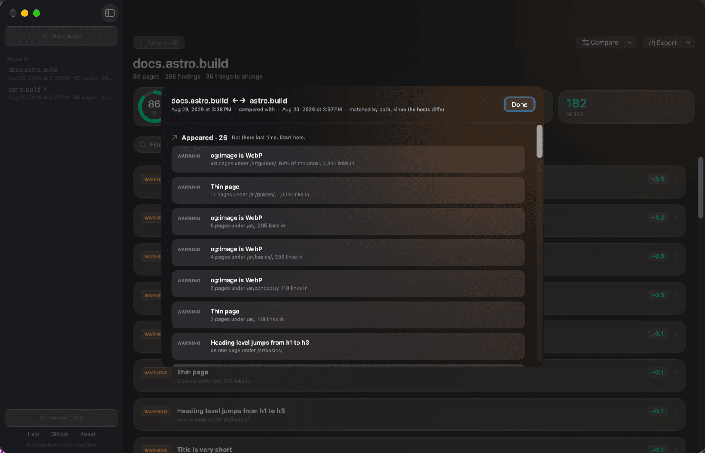

<p align="center">
  <picture>
    <source media="(prefers-color-scheme: dark)" srcset="docs/logo-dark.svg">
    
  </picture>
</p>

<p align="center">
  <b>Crawl a site's sitemap and check every page</b> for the SEO, metadata and
  structured-data problems that single-page graders miss.<br>
  Zero dependencies · one command · works in CI.
</p>

<p align="center">
  <a href="https://github.com/marketplace/actions/full-site-seo-audit"></a>
  <a href="https://github.com/nurkamol/seo-audit/actions/workflows/test.yml"></a>
  <a href="https://github.com/nurkamol/seo-audit/releases/latest"></a>
  <a href="https://www.npmjs.com/package/@nurkamol/seo-audit"></a>
  <a href="https://github.com/nurkamol/seo-audit/releases"></a>
  = 18">
  
  <a href="LICENSE"></a>
  <a href="docs/hosting.md"></a>
</p>

```yaml
# In a workflow — https://github.com/marketplace/actions/full-site-seo-audit
- uses: nurkamol/seo-audit@v1
  with:
    url: https://example.com
```

```bash
# Or anywhere, with nothing installed
npx @nurkamol/seo-audit https://example.com

# Or from the repository, pinned to a major version. Same tool — but this clones
# 16 MB of app sources and tests to get at a 115 kB crawler.
npx github:nurkamol/seo-audit@v1 https://example.com

# Or keep it, if you would rather just type `seo-audit`
npm install -g @nurkamol/seo-audit
```

Every `npx github:…` in the examples below works as `npx @nurkamol/seo-audit`
or as a plain `seo-audit`; they are the same bytes, fetched differently.

<p align="center"></p>

> ### Not a terminal person? There is a window.
>
> **SEO Audit** for macOS is the same tool with a window instead of a prompt:
> type a domain, press return, watch it crawl, and read the report as cards you
> can expand, filter and search. No flags to learn, no output to redirect, and
> nothing leaves your machine.
>
> ```bash
> brew tap nurkamol/seo-audit https://github.com/nurkamol/seo-audit
> brew trust nurkamol/seo-audit
> brew install --cask seo-audit
> ```
>
> It is a window over this engine, never a second copy of it — the checks are
> the same ones the command line and the Action run, so the reports match. See
> [A window instead of a terminal](#a-window-instead-of-a-terminal), or
> [download it](https://github.com/nurkamol/seo-audit/releases/latest) if you
> would rather not use Homebrew.

---

## Why

Free SEO graders audit **one URL**, almost always the homepage. They will tell
you your title tag is 48 characters and your homepage loads in 0.38 seconds,
and happily award a B+ to a site where page 23 has a duplicate description,
page 31 is 112 words long, and the language switcher links to a 404.

That last one is real. This tool's first run against a production site found
the EN/RU switcher on every translated article pointing at a page that did not
exist. Three commercial graders had audited the same site that morning; none
could see it, because the link is only broken on pages they never opened.

**What it owns:** technical correctness, on every page, every deploy.
**What it will not pretend to own:** rankings. Those are decided by backlinks,
a Business Profile and content people want — none of which a crawler can fix.
It also refuses to *estimate* performance; with `--psi` it asks Google for the
real measurement instead.

|  | seo-audit | Typical free grader |
|---|---|---|
| Pages checked | Every URL in the sitemap | One |
| Cross-page checks | Duplicates, hreflang pairs, orphans | — |
| Broken links | Whole-site sweep | — |
| Regression guard | Baseline diff, fails CI on new findings only | — |
| Performance | Google's own numbers via `--psi` | Estimated, or Lighthouse on one page |
| Output | Terminal · Markdown · HTML · JSON | A web page and a PDF upsell |
| Cost | Free, no account | Free tier, then a subscription |

<p align="center"></p>

---

## The playbook

The tool verifies about two thirds of what a site needs. The rest is judgement,
content and off-site work, and it is written down:

### 📋 [docs/SEO-PLAYBOOK.md](docs/SEO-PLAYBOOK.md)

A checklist for taking a site from "probably fine" to genuinely clean —
crawlability, internal linking, multilingual, images, social previews,
structured data, performance, credibility and local search. Ordered by impact
and written from what was actually broken on real projects, including the traps
that only show up once you have hit them.

```bash
# In a new project
curl -o docs/SEO-PLAYBOOK.md \
  https://raw.githubusercontent.com/nurkamol/seo-audit/main/docs/SEO-PLAYBOOK.md
curl -o seo-audit.config.json \
  https://raw.githubusercontent.com/nurkamol/seo-audit/main/docs/seo-audit.config.example.json

npx github:nurkamol/seo-audit@v1 https://example.com --html audit.html
```

Then work down the checklist. It ends with a prompt for handing the whole
thing to an AI agent, including the two instructions that keep an enthusiastic
pass from doing damage: don't invent business facts, and don't declare success
against a stale cache.

---

## Usage

```bash
# Crawl and print to the terminal
npx github:nurkamol/seo-audit https://example.com

# Save a Markdown report you can commit, diff, or send to a client
npx github:nurkamol/seo-audit https://example.com --md audit.md

# Audit a local build before it ships
npm run preview &
npx github:nurkamol/seo-audit http://localhost:4321 --limit 50

# A whole portfolio, one table
npx github:nurkamol/seo-audit one.example two.example three.example
```

### How the report is organised

Findings are grouped by **area**, not just by severity — Indexability, Content,
Links, Redirects, Images, Social, Structured data, Multilingual, Sitemap &
robots, Site & security, Performance. Severity says how loudly to complain; the
area says who fixes it. Thirty findings sorted only by severity is a list you
read once; the same thirty under *Images* and *Multilingual* is a list you can
hand to two people.

Findings on a page that **won't be indexed** — it carries `noindex`, or its
canonical points somewhere else — are marked `not indexable`. The same thin
page is a problem when Google will index it and noise when it won't, and that
distinction is often more useful than the severity.

### What to fix first

Every report opens with the work rather than the findings. The same check on
pages of one section is one piece of work — that is how a generated site is
built — so a store's 2,081 findings read as 62 things to change, ordered worst
first and then by how much of the site points at them:

```
✗  No <h1>                              10 pages under /pages/
!  Heading level jumps from h1 to h3   225 pages under /products/, 69% of the crawl
!  Structured data is missing headline   7 pages across the site, 1,047 links in
```

The link counts and the distance from the homepage are counts of links that
were actually read, not a score: seven pages the site points at constantly are
worth more than ten it mentions once, and that is an ordering rather than a
number out of a hundred.

### A window instead of a terminal

```bash
node bin/seo-audit.mjs --serve          # http://127.0.0.1:4321
```

The same form the hosted version serves, on this machine: no account, no bill,
and none of a Worker's limits — the crawl is bounded by what this computer will
do, which is the only place a five-thousand-page site with `maxImageChecks`
past a thousand fits.

It is not a second implementation. `worker/index.mjs` is written against
`Request` and `Response`, which Node has too, so the same file answers both and
`src/serve.mjs` is thirty lines of adapter. Bound to the loopback address,
which is the whole of its security model.

There is a macOS app in [`mac/`](mac/README.md):

```bash
brew tap nurkamol/seo-audit https://github.com/nurkamol/seo-audit
brew trust nurkamol/seo-audit          # Homebrew asks before running a third party's code
brew install --cask seo-audit
# or build it yourself — swiftc and the command line tools, nothing else
./mac/build.sh --run
```

<p align="center"></p>

<p align="center"><em>A real run against astro.build — and the one error at the top is a link to a page that does not exist, which is the bug this tool was written to catch.</em></p>

<p align="center"></p>

<p align="center"><em>Compare two runs: a site against itself last week, or one property against another. Different hosts are matched by path.</em></p>

#### If you downloaded the zip instead: "SEO Audit is damaged and can't be opened"

It is not damaged. The app is **ad-hoc signed** rather than notarised, because
notarising needs a paid Apple Developer account this project does not have.
macOS puts a `com.apple.quarantine` flag on anything a browser downloads, and
for an app without a notarisation ticket Gatekeeper refuses it — with a message
that says "damaged" and offers to move it to the Trash, which reads exactly like
malware and is the single most confusing thing about installing this.

**`brew install --cask seo-audit` does not have this problem.** Homebrew checks
the download against a checksum written by the build that produced it, then
clears the flag for you. That is the recommended route, and the rest of this
section is for people who would rather not use Homebrew.

If you downloaded the zip by hand, verify it first. Every release attaches a
`SHA256SUMS.txt` covering all four downloads, and lists the same checksums in
its notes — save it next to the file and:

```bash
shasum -a 256 --ignore-missing -c SHA256SUMS.txt
```

`--ignore-missing` because you almost certainly downloaded one of the four, not
all of them. The same command verifies the `.deb`, the `.AppImage` and the
`setup.exe`, which matters most on Windows, where the advice for SmartScreen is
otherwise just "run it anyway".

Then, once it matches, clear the flag:

```bash
xattr -dr com.apple.quarantine "/Applications/SEO Audit.app"
```

No `sudo`: the app is yours, in a directory you can write to, and the command
works as you. If it ever answers `Operation not permitted`, the copy is owned by
another user — `sudo xattr -dr com.apple.quarantine "/Applications/SEO Audit.app"`
is the fallback, but reach for it second, not first.

This is exactly what right-click → **Open** does in the Finder, minus the
dialog. Do it because the checksum matched, not because a README said to — the
same command on a file you have not checked is how people get hurt.

Or avoid the question entirely and build it yourself, which produces a signature
your own machine already trusts:

```bash
./mac/build.sh --run
```

SwiftUI throughout, Liquid Glass, and the report drawn natively: cause cards
that expand into the pages they affect, filtering, search, and export as PDF,
HTML, Markdown, CSV or JSON. Every finished run is kept, so a seven-minute
crawl survives closing the window. No web view in it.

It is a window over this engine and not a second one. The app runs
`node bin/seo-audit.mjs --serve` as a child process and reads its stream, and
the grouping into causes travels with the findings rather than being recomputed
in Swift — a check written twice is a check that drifts. `Report.swift` keeps
that seam explicit, so a Swift engine would be one more conformance and no
change to anything above it.

### In Raycast

```
Preview a Site     how big is this, and is it the right one — ~1s, 3 requests
Audit a Site       crawl it and list what to change, worst first
Recent Reports     runs the macOS app has already kept
```

`raycast/` is a Raycast extension that imports the engine the same way the
Worker does — `import { preview } from "../../src/audit.mjs"` — so it
re-implements nothing and its reports match the terminal's. Raycast runs Node,
so unlike the hosted version the certificate checks work there.

**Preview is the command it exists for.** A crawl takes minutes and a launcher
is built for the second you spend in it, so the headline command is the engine's
`--dry-run`: how many URLs the sitemap lists, how many would be checked, and
where the weight of the site is. Auditing is capped by preference, and a
thousand-page site is told to use the app or the terminal rather than left
spinning.

### What the pages actually do in Google

```bash
node bin/seo-audit.mjs https://example.com --search-console
node bin/seo-audit.mjs https://example.com --search-console sc-domain:example.com
```

Every other ordering here is derived from the site's own markup — how many
links point at a page, how far it is from the homepage. Those are proxies.
Impressions are not: a broken canonical on a page with four thousand
impressions a month is a different sentence from the same canonical on a page
nobody has been shown.

Opt-in, and the only thing in this tool that needs an account. It reads
`GSC_CLIENT_ID`, `GSC_CLIENT_SECRET` and `GSC_REFRESH_TOKEN` from the
environment or from `~/.config/seo-audit/.env`, deliberately outside any
repository.

Getting the third one used to be left as an exercise, which is why this had
never run against the live API. Now:

```bash
# once, in console.cloud.google.com:
#   enable the Search Console API, then create an OAuth client of type
#   "Desktop app", and put its two values in ~/.config/seo-audit/.env
#     GSC_CLIENT_ID=…apps.googleusercontent.com
#     GSC_CLIENT_SECRET=…

npx @nurkamol/seo-audit --search-console-login
```

That opens a browser, you sign in, and the refresh token is written to the same
file at mode `600`. It is never printed — a token echoed to a terminal is a
token in a scrollback buffer and probably in a shell history file. The scope is
read-only. Afterwards it lists the properties the account can actually read,
because a token that can read nothing looks exactly like one that works, right
up until an audit reports the property was not found.

Interactive by nature, so it is deliberately **not** a GitHub Action input: a
flag CI can accept and never satisfy is worse than no flag. In CI, set the
three variables as secrets.

It also brings back **where Google puts each page**, and what it is found for:

- Every finding on a page Google ranks carries that page's average position, so
  the report can put a template on page two ahead of one nobody has been shown.
  Positions were in every response Google has ever sent and were being discarded.
- **`search-console-striking`** names the crawled pages sitting at positions 11
  to 20 — page two, where the click-through rate is roughly nothing and the
  ranking is already earned — with the query each one is closest on. It is the
  only list in this tool that is an opportunity rather than a fault, and every
  number in it was measured by Google. Moving one of those up two places is
  usually less work than a new page.

Neither needs a second account, a scrape, or a keyword provider: it is the same
connection, asked one more question. Google withholds any search too rare to be
anonymous, so a low-traffic property gets positions and no queries — and the
report says so rather than leaving silence to read as "found for nothing".

The whole setup, the property-naming trap and what each failure note means:
[docs/search-console.md](docs/search-console.md). A domain property is named `sc-domain:example.com` rather than by
its URL. Missing credentials, or a property the account cannot read, are a note
and the rest of the audit is unaffected.

### Telling two readers apart

```bash
node bin/seo-audit.mjs https://example.com --compare-as googlebot
```

Fetches a sample of pages a second time as somebody else and reports what
changed. Not a byte comparison — a nonce, a timestamp and a cart count all
differ between two fetches of the same page by the same client. What is
compared is what a search engine reads: status, title, canonical, robots meta,
word count and link count.

forbes.com serves Googlebot roughly half the words it serves Chrome on every
page sampled. jekyllrb.com is identical on all ten, and says so rather than
staying silent.

### Crawling as something else

```bash
# What Google is served, which is not always what a person gets
node bin/seo-audit.mjs https://example.com --browser googlebot

# What a host that blocks crawlers will answer at all
node bin/seo-audit.mjs https://example.com --browser chrome --os windows
```

Three reasons this matters, and none of them is dressing up. A site that
answers a browser and blocks everything else is common, and the report from a
blocked crawl is a report about the block. Some sites serve different HTML to a
crawler than to a person, and fetching as Googlebot is the only way to see it.
And Google indexes what its **smartphone** crawler sees — `--browser googlebot`
is that one, `googlebot-desktop` is the other.

`--os` says which system the browser is running on and defaults to yours.
A combination that does not exist is refused rather than approximated:

```
$ … --browser safari --os windows
  safari does not run on windows. It runs on: macos, ios.
```

The strings are a snapshot and will age — browser versions move every few weeks
and nothing here can know that. They are close enough for a server deciding
whether to answer, and `--user-agent` still takes a literal string for anything
that has to be exact. It outranks `--browser` when both are given.

### Checking outbound links

Off by default, and that's a judgement rather than an omission:

```bash
npx github:nurkamol/seo-audit https://example.com --check-external
```

These are other people's servers. They rate-limit, they bot-block, and plenty
answer `403` to anything without a browser's fingerprint — so only a **404, a
410, or no answer at all** is ever reported as broken. An outbound link that
merely redirects is a note, not a problem. `maxExternalChecks` bounds the sweep
(default 100), because one machine hammering a hundred third parties is rude at
scale.

### Watching a run

A crawl of any size is otherwise silent from the first line to the last, which
makes a slow site look exactly like a hung one. `--verbose` prints each request
as it happens:

```
  sitemap    /sitemap-index.xml  42 URLs
  crawl      200    128ms  /
  crawl      200    180ms  /faq/
  crawl      200    343ms  /about/
  crawl      42 pages in 6.8s
  links      87 distinct targets to check
  links      404     92ms  /old-page/
  images     26 distinct images to check
  psi        measuring 1 of 3 (~12s)  /
```

Plain lines rather than a spinner, deliberately: a long run is exactly the one
whose output gets piped to a file or read back out of a CI log, and neither can
show a cursor trick. It also means the page a crawl is stuck on stays on screen
instead of being overwritten — a timeout arrives as status `0`, so a stall is
visible rather than blank.

Everything goes to **stderr**, so `--json` and `--md` are unaffected and
`… --verbose --json report.json` still writes clean JSON. `--quiet` wins over
`--verbose`: asking for silence and getting a running commentary would be the
more surprising of the two.

### Checking a migration's redirects

A redirect map is written once, verified once, and then rots quietly: a later
change to a destination turns an entry into a hop through a 404, and nothing
tells anyone. The old URLs are the ones carrying the links and the rankings, so
this is one of the few SEO failures that is both expensive and completely
silent.

```bash
npx github:nurkamol/seo-audit https://example.com --redirects _redirects
```

The file is the Netlify `_redirects` shape, which is also what most people
write by hand — `#` comments, and `to` and the status both optional:

```
/old-path        /new-path      301
/also-old        /new-path
/just-an-old-url
```

Every old URL is asked for, and what actually happens is reported:

| | |
|---|---|
| `redirect-dead` | error — the old URL 404s. The rule never shipped |
| `redirect-broken` | error — it redirects, and lands on nothing. Worse than no rule, because it looks handled |
| `redirect-not-applied` | warning — the old URL still answers 200 |
| `redirect-hops` | warning — more than one hop to arrive |
| `redirect-elsewhere` | warning — lands somewhere the map does not expect |
| `redirect-temporary` | warning — served as 302 where the map says 301 |

Rules with a `*` or a `:placeholder` match a shape rather than a URL, so asking
for them literally proves nothing. They are counted and reported, never guessed
at. A rule that works in one hop reports nothing at all.

### Sites without a sitemap

If no sitemap can be found, the crawl follows links from the homepage instead
of stopping — the sites least likely to have been looked after were the ones
this used to refuse to look at. `no-sitemap` is still reported, as a warning
rather than an error, because the pages get audited either way.

The link crawl obeys `robots.txt`, follows a redirecting homepage (plenty of
sites send `/` to a locale), skips assets, and treats two URLs redirecting to
one page as one page. `missing-from-sitemap` stays quiet, since every page
found this way is by definition absent from a sitemap that does not exist.

### A portfolio

Name more than one site and the report becomes a table, worst site first —
which is the question a per-site report can never answer, because each one
only ever sees itself.

```
  Portfolio — 3 sites · 24 pages · 36.3s

  SITE                   PAGES     ✗     !     ·
  fitculturepilates.com      8     2    28    20
  vitejs.dev                 8     2    19    32
  astro.build                8     1    31    26

  5 errors across 3 of 3 sites  ·  78 warnings  ·  78 notes
```

`--md` and `--html` write one file with the table on top and each site's full
report underneath, so a single section can be lifted out and sent to whoever
owns that site. `--json` writes one object with a `sites` array. The run exits
1 if **any** site fails, because a portfolio check that passes while a site in
it is broken is a check nobody can trust.

Sites run one at a time: interleaved progress from twenty hosts is unreadable,
and each audit is already parallel inside itself.

`--baseline`, `--against` and `--update-baseline` compare a site against
itself, so they refuse to run across a portfolio rather than half-answering the
question. Run those per site. The GitHub Action is single-site for the same
reason.

### Options

| Option | Default | |
|---|---|---|
| `--md <file>` | — | Write a Markdown report |
| `--html <file>` | — | Write a self-contained HTML report — one file, no assets |
| `--since <date>` | — | Crawl only URLs the sitemap says changed on or after this date. Refuses when `lastmod` cannot answer it |
| `--exclude <glob>` | — | Leave URLs out of the crawl. Repeatable; `*` stops at a slash, `**` does not |
| `--dry-run` | — | Say what would be crawled and stop. A handful of requests instead of hundreds |
| `--write-sitemap <file>` | — | Write the sitemap this site should have had. Refuses on a crawl that did not see the whole site |
| `--write-llms <file>` | — | Write the `llms.txt` this site should have had, in the [llmstxt.org](https://llmstxt.org) format, from the site's own titles and descriptions. Nothing is generated or rewritten. Refuses on a partial crawl, for the same reason |
| `--write-schema <file>` | — | Write the JSON-LD this site could add — `WebSite`, `Organization`, `BreadcrumbList` — built **only** from strings the crawl read off the site. A step it cannot name from the site's own words is skipped, never invented from a slug |
| `--json <file>` | — | Write a JSON report — findings, the grouped `causes` with their scope lines, and `meta`. Also usable as a baseline, which carries the findings only |
| `--csv <file>` | — | Write the checklist as a spreadsheet: one row per finding with a `points` column for what fixing it is worth, then the checks that passed (`pass`) and the ones that did not apply (`not-checked`) |
| `--baseline <file>` | — | Compare against a previous `--json` run; show only what changed |
| `--update-baseline` | — | Rewrite the baseline after comparing |
| `--limit <n>` | 200 | Maximum pages to check |
| `--concurrency <n>` | 6 | Parallel requests. Comes down on its own if the server answers `429` |
| `--sitemap <url>` | auto | If `robots.txt` doesn't declare one and it isn't at a usual path. Without any sitemap, the crawl follows links instead |
| `--redirects <file>` | — | Check a migration's redirect map against the live site (see below) |
| `--check-external` | — | Also check links pointing off the site (see below) |
| `--browser <name>` | — | Crawl as `chrome`, `firefox`, `safari`, `edge`, `googlebot`, `googlebot-desktop` or `bingbot` |
| `--os <name>` | this one | The system that browser runs on: `macos`, `windows`, `linux`, `android`, `ios` |
| `--user-agent <ua>` | `seo-audit …` | Identify as something else. A literal string, and it outranks `--browser` |
| `--config <file>` | `seo-audit.config.json` | Per-site configuration |
| `--ignore <ids>` | — | Comma-separated check ids to silence for this run |
| `--psi <urls>` | — | Measure these pages with PageSpeed Insights. A path glob names a section (see below) |
| `--psi-sample <n>` | 3 | Pages measured per section glob |
| `--psi-strategy` | `mobile` | `mobile` or `desktop` |
| `--against <url>` | — | Compare against another deployment now — a rebuild against the site it replaces. Findings are matched by path, so the two hosts need not be the same |
| `--settle <s>` | — | Wait until the site serves consistent HTML before crawling |
| `--fail-on <level>` | `error` | Exit 1 at `error`, `warn`, `new`, or `never` |
| `--version` | — | Print the version |
| `--quiet` | — | Print nothing; use the exit code and the files |
| `--verbose` | — | Print each request as it happens, to stderr (see below) |

---

## Configuration

Every site has findings that are true and deliberate. A contact page is *meant*
to be short; a privacy policy has no business carrying editorial links. Left
unsaid, those fill the report with noise nobody reads, and the one new finding
that matters gets lost.

Drop a `seo-audit.config.json` next to where you run it:

```json
{
  "limit": 200,
  "failOn": "error",
  "limits": { "thinWords": 250 },
  "sites": [
    "https://one.example",
    { "url": "https://two.example", "limit": 50, "ignore": ["thin-content"] }
  ],
  "maxLinkChecks": 200,
  "maxImageChecks": 200,
  "psi": ["/", "/pricing/", "/journal/**"],
  "ignore": [
    "img-srcset",
    { "id": "thin-content", "urls": ["/contact/", "/thanks/", "**/legal/**"] },
    { "id": "no-editorial-links", "urls": ["**/privacy-policy/", "**/terms-of-use/"] }
  ],
  "expect": [
    { "urls": ["/journal/*/"], "types": ["BlogPosting"] },
    { "urls": ["/"], "types": ["LocalBusiness", "WebSite"] },
    { "urls": ["/faq/"], "types": ["FAQPage"] }
  ]
}
```

- **`sites`** — a portfolio. Each entry is a URL, or an object with a `url` and
  whatever that site overrides — a portfolio is not a list of interchangeable
  sites, and one of them has a deliberately short contact page. Overrides land
  on top of the shared config; `ignore` accumulates rather than replacing,
  since a portfolio-wide rule and a site rule are both meant to apply. URLs
  given on the command line replace this list entirely, which is how you audit
  a subset.
- **`limits`** — thresholds this site disagrees with: `titleMin`, `titleMax`,
  `descMin`, `descMax`, `thinWords`, `slowMs`, `maxClickDepth`.
- **`maxLinkChecks`** — how many distinct link targets the site-wide sweep
  fetches, default 200. The sweep checks every internal link on every crawled
  page, so a large site can present thousands of targets; this bounds the run.
  When it bites, the report says how many were left unchecked rather than
  quietly describing a fraction of the site.
- **`maxImageChecks`** — the same bound for the image sweep, default 200,
  counted in distinct **files** rather than URLs. An image CDN serves one file
  at every size asked for, so `photo.avif?width=150` and `?width=750` are one
  image and one request; `width`, `height`, `w`, `h` and `dpr` are dropped
  before counting, and `v` is not, because a different version is a different
  asset. On a real store this was 488 files behind 767 URLs. The report names
  the number to set if the cap was reached.

- **`maxExternalChecks`** — how many outbound links `--check-external` fetches,
  default 100. Third-party hosts are somebody else's to hammer.
- **`redirects`** — path to a redirect map, the same as `--redirects`.
  **`maxRedirectChecks`** bounds how many of its rules are tested, default 200.
- **`psi`** — pages to measure with PageSpeed Insights, as paths. A path glob
  names a section: `/journal/**` measures a sample of the crawled pages under
  it, three by default, spread across the section rather than taken off the
  front. PageSpeed Insights costs about 12 seconds a page, so a section of
  forty measured whole is eight minutes — the report says how many of the
  matched pages were actually measured, because a sample that stayed quiet
  about the rest would read as a clean bill of health for the whole section.
  Raise it with `--psi-sample`, and expect the wait. The sample is the same on
  every run, so a `--baseline` comparison stays meaningful.
- **`ignore`** — a bare check id silences it everywhere; `{ id, urls }` silences
  it only where it is intended. `*` stops at a slash, `**` does not. The id is
  printed with every finding.
- **`expect`** — which schema types a group of pages must carry. This is the
  difference between "the JSON-LD parses" and "this article is actually marked
  up as an article", and it is the check that catches a template quietly
  dropping its structured data.

---

## Catching regressions

The useful question after the first run is not "how many warnings" — that
number stops moving. It is "did this deploy break something that worked
yesterday".

```bash
# First run writes the baseline
seo-audit https://example.com --baseline seo-baseline.json

# Later runs report only the difference
seo-audit https://example.com --baseline seo-baseline.json
```

```
  ✓ 3 fixed since 2026-08-08
    · Link to a page that does not exist  https://example.com/ru/journal/…

  ✗ 1 new since 2026-08-08
    ✗ Missing expected structured data: BlogPosting
      Page declares WebSite.
      · https://example.com/journal/new-article/

  12 unchanged
```

Commit the baseline. `--fail-on new` then fails a build on a regression while
tolerating the backlog you already know about — which is what makes the check
survivable in CI instead of being switched off in week two.

### In CI

```yaml
- run: |
    npx github:nurkamol/seo-audit https://example.com \
      --baseline seo-baseline.json --fail-on new --md audit.md
- uses: actions/upload-artifact@v4
  if: always()
  with: { name: seo-audit, path: audit.md }
```

---

## The window, on Linux and Windows

The macOS app is a thin client over a local server, and that server runs anywhere Node does:

```bash
npx @nurkamol/seo-audit --serve
```

It opens a browser onto the same window the macOS app draws: a sidebar of kept runs down the left, the report beside it, score ring and all. Everything the command line takes is in the form — the same table that decides what the macOS window reaches decides what this draws, so neither can quietly fall behind the other. Finished runs are kept and listed at `/reports`, two of them can be compared, and on macOS it is **the same folder the app uses**: a crawl started in the window is in the browser's list a second later, because there is one folder rather than two.

Nothing leaves the machine. It binds to the loopback address, which is the whole of its security model.

There is also a **native window for Windows and Linux** built on exactly this: a
Tauri shell that starts the same server and shows the same report, in
[`desktop/`](desktop/README.md). It ships a Node inside it, so there is nothing
to install first. Every release attaches a `setup.exe`, a `.deb` and an
AppImage, each built on its own runner and then **installed and run there**
before it is attached. It tells you when there is a new version and offers
whatever is safe for the way you installed it — `winget upgrade` in place, or
the command to run, or the release page.

`--no-open` if you would rather it did not open a browser. It opens one when a person ran the command and never when something else did, so the macOS window — which spawns this — is unaffected.

---

## Hosting it, for people who will not open a terminal

Optional, and off the main path. Everything above is free and runs on your own
machine; this is a small password-protected web page you deploy to **your own
Cloudflare account**, so a colleague can audit a site by filling in a form. It
runs the same code and produces the same report.

<p align="center">
  <a href="https://deploy.workers.cloudflare.com/?url=https://github.com/nurkamol/seo-audit"></a>
</p>

<p align="center">
  <sub><b>Needs the $5/month Workers Paid plan.</b> Your account, your bill.<br>
  Read <a href="docs/hosting.md">docs/hosting.md</a> before you click it.</sub>
</p>

The short version:

- **It cannot run on Cloudflare's free plan.** 10ms of CPU and 50 outbound
  fetches per invocation works out at about sixteen pages — which is the exact
  failure this tool exists to point at. It needs the **$5/month Workers Paid**
  plan.
- **After that it is effectively free to run.** Cloudflare does not bill for the
  fetches a Worker makes, so the crawl costs nothing and an audit is about a
  hundredth of a cent of CPU. The $5 is the whole bill for normal use.
- **The charge is recurring and it is yours.** Your account, your card, your
  agreement with Cloudflare. Deleting the Worker does not cancel the plan.
  MIT licence, no warranty, at your own risk.
- **It will not audit anything until you set `AUDIT_TOKEN`.** What you are
  deploying is a crawler with a public address, and an open one gets pointed at
  other people's sites from your account. Set `ALLOWED_HOSTS` too.
- **Two checks do not work there.** `tls-expiring` and `tls-expired` need a TLS
  socket the Workers runtime does not offer. Every hosted report says so, rather
  than quietly coming up two checks short.

If you have a GitHub repository, the Action above is free, unlimited and
better. This is for the case where it genuinely has to be a web page.

---

## What it checks

Findings come at three levels: **error** (wrong, and costing traffic), **warning** (worth fixing, judgement involved), **note** (worth knowing, may be deliberate).

### Per page

| Check | Level |
|---|---|
| Page returns 200 and is not a redirect listed in the sitemap | error |
| The body is actually HTML — an XML or JSON file served as `text/html` is crawled and indexed as a page | warning |
| A page the server answers `429` to is reported as rate limited, never as a page that failed — the crawl waits, slows down and comes back first | note |
| `noindex` on a page the sitemap advertises | error |
| `X-Robots-Tag: noindex` — the same instruction as a header, invisible in the HTML | error |
| `nofollow` on the page — Google follows none of its links, navigation included | warning |
| The robots meta tag and `X-Robots-Tag` don't contradict each other | warning |
| No `<meta http-equiv="refresh">` — a redirect nothing treats as one | warning |
| Internal links aren't `rel="nofollow"` — a page refusing to pass through its own site | note |
| `<title>` present, 15–60 characters | error / warning |
| Meta description present, 70–160 characters | warning |
| Exactly one `<h1>` | error / warning |
| `lang` attribute and viewport meta | warning / error |
| The viewport doesn't block zooming — `user-scalable=no` or a `maximum-scale` under 2 forbids the 200% WCAG 1.4.4 asks for, and Safari has ignored it since iOS 10 | warning |
| The viewport isn't a fixed pixel width — `width=1024` lays the page out that wide on a phone and scales it down, and that is what Google indexes | warning |
| Canonical present, single, self-referencing | warning / error / note |
| The canonical target isn't `noindex` — a page that hands its indexing to one leaves the index with it | error |
| Page 2 of an archive names itself, not page 1 — Google's guidance is "Don't use the first page of a paginated sequence as the canonical page", and a sitemap almost never lists these pages, so they're read where they're linked | error |
| The canonical target isn't itself canonicalised elsewhere — Google needn't follow a chain | warning |
| `og:title` present — shared links otherwise fall back to the page title | warning |
| `og:description` present — shared links otherwise preview whatever the platform scrapes | warning |
| `og:image` present — shared links otherwise preview with no picture | warning |
| `og:image` is an absolute URL — a scraper has no page to resolve a relative one against | error |
| `og:image` is not WebP — LinkedIn won't render it, WhatsApp is unreliable | warning |
| `og:image` declares width and height | note |
| `hreflang` codes are well formed — `en_US` with an underscore is the usual slip | error |
| `hreflang` lists the page itself, not only its translations | warning |
| `<html lang>` agrees with what the page's own `hreflang` calls it | warning |
| `<html lang>` agrees with the `Content-Language` header, compared by primary subtag — a header listing several languages agrees if the page's is one of them | warning |
| JSON-LD parses and carries a `@type` (or a `@graph`) | error / warning |
| Types Google can render carry the properties it requires — an `Article` with no `headline` gets no rich result | warning |
| The dates do not contradict themselves — a page modified before it was published, or dated next Tuesday, is not a freshness signal | warning |
| Images named in structured data actually load | warning |
| Every `` has an `alt` attribute (empty is correct for decorative) | error |
| `alt` isn't a filename — `alt="DSC_0042.jpg"` is what a CMS fills in for you | warning |
| `alt` isn't a placeholder — `alt="image"`, `alt="logo"` name the medium, not the content | warning |
| Three or more images don't share one `alt` | note |
| `alt` is under 125 characters — it's read in one breath, with no way to skim | note |
| `title` doesn't just repeat `alt` — one field filling both adds nothing and can be read twice | note |
| `title` isn't attached to an image declared decorative — the markup contradicts itself | note |
| Every `` has `width` and `height` — otherwise the page reflows | warning |
| Images offer a `srcset` rather than one size for every screen | note |
| No image is both `loading="lazy"` and `fetchpriority="high"` — told to wait and told to hurry, and lazy decides when | note |
| Word count above ~300 — Japanese, Chinese and Thai are counted by character, since they don't space words | warning |
| At least one link inside the content, not just navigation | note |
| No `http://` **subresources** on an HTTPS page — a hyperlink to one is not mixed content | error |
| HTML arrives compressed, once it's big enough to be worth compressing | warning |
| Images declared decorative by `alt=""` **or** `role="presentation"` are left alone | — |

### Across pages

| Check | Level |
|---|---|
| No two pages share a title | warning |
| No two pages share a meta description | warning |
| `hreflang` is reciprocal — Google drops one-way pairs | error |
| Something in the `hreflang` set is an `x-default` | note |
| Pages carry the schema types `expect` says they should | error |
| No page is an orphan — in the sitemap but linked from nowhere | warning |
| Orphans are only looked for when the crawl actually saw the site — a run cut short by `--limit`, or with pages that never loaded, says so instead of calling a fragment full of orphans | note |
| Every page is within four clicks of the homepage, counted over the links actually in the HTML | note |
| Every page has *some* path from the homepage — one that hangs off an unreachable page is only found by handing Google the sitemap | warning |
| Every destination has at least one link that names it — an icon or an `alt=""` thumbnail with no text, no `aria-label` and no `title` tells Google nothing and reads a URL aloud to a screen reader | warning |
| No page is described only by "read more" — the words on a link are the one description of a page that does not come from the page itself | note |
| No phrase describes two different pages — "Collections" pointing at both the reference page and the tutorial chapter makes them compete, and only destinations this crawl fetched are compared | note |

### Whole site

| Check | Level |
|---|---|
| `robots.txt` exists, does not block everything, advertises the sitemap | error / warning / note |
| No sitemap URL is disallowed by `robots.txt` — the site contradicting itself | error |
| Every sitemap URL is actually indexable — not `noindex`, not canonicalised away | warning |
| Each sitemap file is within the protocol's 50,000 URLs and 50MB | error |
| **Pages that are the same page again** — the bodies compared, not just titles and descriptions. Silent on a page that says `noindex`, on a page whose `rel=canonical` already points at the original, and on a page with no `<main>` or `<article>` to read content from, which it says rather than skips | warning |
| A sitemap is actually absent before absence is reported — a probe that answers 429 is `sitemap-not-checked`, not `no-sitemap` | warning |
| The sitemap declares `lastmod` at all | note |
| `lastmod` differs between pages — one date on every URL is a build stamp, and crawlers learn to ignore it | note |
| No URL is listed twice — across two files of an index, or twice in one. Image and video sitemaps are skipped, since one entry per image is the format working | note |
| No `lastmod` is in the future | warning |
| A favicon Google can use — the home page declares one that loads, or `/favicon.ico` is there | warning / note |
| `llms.txt` exists | note |
| **Which AI crawlers robots.txt lets in** — GPTBot, ClaudeBot, PerplexityBot, Google-Extended, CCBot and eight more, asked of the same parser Google's rules go through. Split by what blocking costs: an *answering* crawler fetches because somebody asked a question just now, a *training* one does not, and blocking the second changes nothing about being cited today. Always a **note**: refusing an AI crawler is a decision a publisher is entitled to make. It also says whether anybody made it — a block that arrives through `User-agent: *` is usually a CDN or plugin default | note |
| `llms.txt` and `robots.txt` do not contradict each other — a site that serves a file whose only purpose is to tell an assistant what to read, while disallowing the agent that would read it, has one of the two files wrong | warning |
| Everything once-per-domain is read on the host that answers — audit `example.com` when the site lives at `www.` and the audit moves there, saying so, rather than reading robots.txt off a 301 | note |
| `http://`, `www.` and `https://www.` each reach the canonical host in one hop — a variant that answers 429 is reported as **not checked**, never as dead | warning / note |
| The TLS certificate is not expired, and not expiring within 14 days | error / warning |
| HSTS, `X-Content-Type-Options`, `Referrer-Policy`, CSP headers | warning / note |
| A URL that cannot exist returns 404, not a 200 error page — the redirect chain is followed to its end | error / warning |
| There is something to audit at all — no sitemap *and* no crawlable homepage is `nothing-crawlable`. If the server rate-limited the run instead, it says so and claims nothing about the site | error |
| Every internal link resolves — the site-wide 404 sweep | error |
| Any linked page that turns out to be page 2 of a sequence gets its canonical read, from the response the sweep already fetched | error |
| Outbound links resolve, with `--check-external` — only a 404, 410 or no answer counts | warning / note |
| Every `` actually loads — 403 is hotlink protection, not a broken file, and is not reported | error |
| Every `hreflang` alternate actually loads, including versions outside the crawl | error |
| Internal links point at final URLs rather than redirects | note |
| No page is linked but missing from the sitemap | warning |
| The link and image sweeps say so when they stop at their cap rather than implying they checked everything | note |
| Every `og:image` actually loads, and isn't too heavy to scrape | error / warning |
| A declared `twitter:image` loads, when it differs from `og:image` — its *absence* is fine, X falls back to Open Graph | error |

---

## What it can write for you

Three of the outputs are not reports. They are the fix, built from what the crawl already read:

| | |
|---|---|
| `--write-sitemap` | Every page that answered 200, is HTML, is indexable and is its own canonical |
| `--write-llms` | The [llms.txt](https://llmstxt.org) — the site's own titles and descriptions, grouped by section |
| `--write-schema` | `WebSite`, `Organization` and `BreadcrumbList` as JSON-LD |

All three follow one rule and it is absolute: **every value is a string this crawl read off this site.** Nothing is generated, rewritten, summarised or inferred. A page with no description gets a line without one rather than a sentence somebody made up about it; an organisation is named only when the site names itself in `og:site_name`, because a wrong company name is the worst thing in that file to get wrong.

Breadcrumbs make the rule concrete. A `<title>` is not a breadcrumb name — the first live run of this produced `Assets | Jekyll • Simple, blog-aware, static sites` as a step. So a step is named by the page's `<h1>` when it has exactly one, or by the words the site's own navigation uses to link to it, and by nothing else:

```
  wrote schema.json — 61 block(s) for 61 page(s)
    60   BreadcrumbList          Jekyll › Docs › Assets
    1    Organization
    skipped 142 (a step could not be named from the site's own words)
    skipped 8   (is at the top of the site, so there is no trail to describe)
    skipped 1   (already declares a WebSite)
```

Structured data that describes a site inaccurately is worse than none: it is a machine-readable claim the page does not support, which is a manual-action category at Google. So 142 pages were skipped rather than given a name invented from a URL.

And all three refuse outright on a crawl that did not see the whole site, because a file built from a third of a site is worse than no file — it looks complete. The refusal names the run that would work.

---

## The score

Every report opens with a number out of 100, a grade and a ring:

```
  https://example.com
  31 pages · 71 requests · 12.9s

  74/100   C   ████████████████████░░░░░░░░
  26.1 points across 9 checks · 61 passed · 22 did not apply
  Clear the errors alone and it is 88.
```

It is a checklist that has been counted, and the arithmetic is small enough to print:

| | |
|---|---|
| **A run starts at 100** and pays for what is wrong with it | Nothing is added for passing; a clean site is at 100 because nothing took points off |
| **An error-level check costs 12 points, a warning 4** | Not a new judgement — every check already carries a level, argued over check by check when it was written. `scripts/check-levels.mjs` reads those levels back out of the source and a test asserts the table still matches, so a check promoted from warning to error cannot keep its old weight |
| **A check on some pages costs its share** | A missing `<h1>` on 3 of 40 pages costs a tenth of a warning; the same fault on all 40 costs the whole of one |
| **Notes cost nothing** | A note is "worth knowing, may be deliberate". An `llms.txt` nobody wanted is not a fault |
| **A check that could not run is skipped, not passed** | A site with no images has not passed the alt-text check, and a run without `--psi` has not passed the performance ones. Both would be free points for doing less |

So the score is an amount of known, named, locatable work subtracted from a clean sheet — never a prediction of a ranking, an estimate of traffic, or a grade against anybody else's site. What a check costs is what fixing it is worth, and every piece of work under **Start here** carries the points it returns:

```
    +4.0  ✗ No <h1>                    17 pages under /classes/, 62% of the crawl
    +2.7  ! og:image is WebP           17 pages under /classes/
    +1.3  ! Meta description will be cut off   4 pages under /journal/
```

Two runs of the same site are directly comparable. A run of one site against another is comparable to the degree that the same checks applied to both, which the report says out loud.

### What passed, and what was never checked

A missing finding reads exactly like a passing one, so both are named. **Passing** lists every check the site cleared, in its own words:

```
  ✓ Every page has a title
  ✓ Every image has an alt attribute
  ✓ No og:image is WebP
```

**Not checked** says why the rest did not apply, grouped by reason:

```
  · No page declares hreflang. (hreflang-invalid, hreflang-one-way, hreflang-dead, …)
  · PageSpeed was not asked — run with --psi. (psi-score, psi-lcp, psi-cls, …)
```

The full checklist — every scored check with its weight, its area and its pass line — is served at `/checks` when the [hosted front end](#hosting-it-for-people-who-will-not-open-a-terminal) is running, so "what does this thing actually check" is a question with a fetchable answer.

---

## Reading the output

```
  https://example.com
  31 pages · 71 requests · 12.9s

  74/100   C   ████████████████████░░░░░░░░
  26.1 points across 9 checks · 61 passed · 22 did not apply

  ✗ No <h1> ×17
    The page has no headline.
    · https://example.com/schedule/
    · https://example.com/teacher-trainings/
    …

  ✗ Sitemap URL redirects
    301 → https://example.com/summer-offer/. A sitemap should list final URLs only.
    · https://example.com/spring-into-summer/

  ! og:image is WebP ×17
    LinkedIn does not render WebP previews and WhatsApp is unreliable with it.
    · https://example.com/reformer-classes/
    …

  20 error  91 warning  12 note
```

Findings are grouped by check, not by page, because the fix is usually one change applied everywhere. Errors and warnings come first; notes follow under **Worth knowing**, which says out loud that none of them cost the score anything.

Then **Passing**, then **Not checked**.

Some warnings are meant to be lived with. A contact page is *supposed* to be short; a privacy policy has no business carrying editorial links. The tool reports what is true and leaves the judgement to you — it has no way to know which pages are meant to rank.

---

## Use with

| Tool | For |
|---|---|
| [PageSpeed Insights](https://pagespeed.web.dev) | Core Web Vitals, render-blocking resources, image sizing in practice |
| [WebPageTest](https://webpagetest.org) | The same, from a location your customers actually live in |
| [Rich Results Test](https://search.google.com/test/rich-results) | Whether Google parses your structured data, not just whether it is valid |
| [Search Console](https://search.google.com/search-console) | What Google has actually indexed. The only opinion that counts |
| [Ahrefs Webmaster Tools](https://ahrefs.com/webmaster-tools) | Backlinks — free for domains you verify |

---

## Versioning

Releases follow [semver](https://semver.org). Three ways to pin, in order of
how much you value stability over freshness:

| Reference | Gets you |
|---|---|
| `@v1` | The latest release that is backwards compatible. Moves forward with each one. Recommended |
| `@v1.22.0` | Exactly that release, forever |
| `@main` | Whatever was last pushed, including work in progress |

The same applies to `npx github:nurkamol/seo-audit#v1`.

---

## Contributing

Adding a check means one entry in `src/checks.mjs` (per page), `src/checks.mjs → crossPageChecks` (needs every page), or `src/site.mjs` (once per domain). Each returns `{ level, id, title, detail, url }` and that is the whole contract.

Two rules that keep the tool trustworthy:

1. **No false positives.** A check that cries wolf gets the whole report ignored. If a pattern is sometimes legitimate, it is a `note`, not an `error`.
2. **No dependencies.** It must keep running with a bare `npx` on a machine with nothing installed.

```bash
npm test          # the engine, the Worker and the extension — no install, any platform
npm run test:all  # and the macOS app's own Swift suite, where there is a toolchain for it
```

There are two suites and `npm test` runs one. Keeping it portable is the point — it works on a machine with nothing on it. `test:all` runs both and says plainly when it could not run the second, rather than exiting green having skipped half the work.

See [ROADMAP.md](ROADMAP.md) for what is planned, [CHANGELOG.md](CHANGELOG.md) for what changed.

## Licence

MIT
